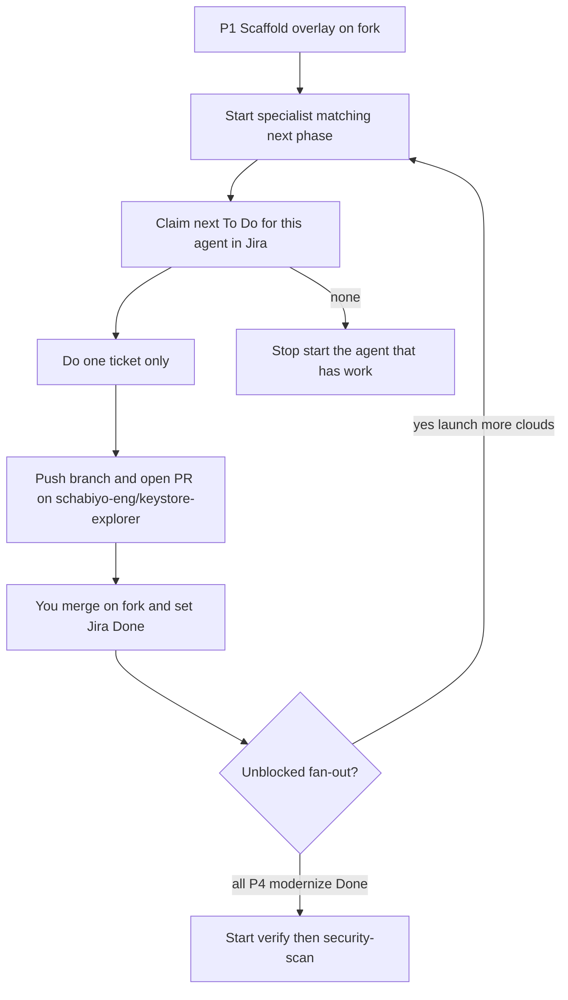

# Model B orchestration

**Jira is the queue.** Start the specialist that matches the work (`inventory`, `test-generation`, `migrate`, `modernize`, `verify`, `security-scan`). That agent claims the next unblocked To Do for **its** `agent-*` label per [PICKUP.md](model-b/PICKUP.md).

Parent chat must not implement specialist work. There is no dispatcher agent, no Python queue, and no `backlog.json`.

**Git:** push and PRs only to [schabiyo-eng/keystore-explorer](https://github.com/schabiyo-eng/keystore-explorer). You merge on that fork. Never public upstream. Full steps: [RUNBOOK.md](RUNBOOK.md).

## Loop

## Agents do not call each other

Inventory writes discovery; test-generation only reads it; migrate does not run verify. Specialists do not shop another agent’s issues. If JQL returns nothing, stop — do not start a different specialist. The operator launches another cloud of the type that has unblocked To Do.

## Ticket fields (Jira)

| Field | Values |
|-------|--------|
| Ticket id | `P2.inventory`, `P3.schema`, `P3.yaml.file`, `P4.kernel`, … |
| Agent | `inventory` \| `test-generation` \| `migrate` \| `modernize` \| `verify` \| `security-scan` |
| Slice | `kernel` \| `file` \| `generate` \| `import` \| `delete-rename` \| `details` \| `export` \| `sign` \| `verify-sig` \| `examine` \| `clipboard` \| `chain` \| `session` \| `chrome` \| `all` |
| Phase | 2–5 |
| Acceptance | shell command |

Use labels `agent-<name>`, `slice-<slice>`, `phase-<n>` so JQL works even without custom fields. Do not use a `model-b` label. **Blocks / is blocked by** = sequencing. Setup: [jira.md](model-b/jira.md). Description body: [TICKET.template.md](model-b/TICKET.template.md).

Abort migrate/test-generation if `.cursor/discovery/SCOPE.md` does not contain `Status: signed` (except `inventory`).

## After a ticket

Draft PR (`pr-composition`) against **schabiyo-eng/keystore-explorer** only. Jira → **In Review**. You merge on the fork, then set **Done**. Do not auto-merge until you have reviewed kernel, File, and session at least once. Never open a PR against public upstream.

## Greenfield clone (start at Phase 1)

Copy into a clean upstream tree whose `origin` is [schabiyo-eng/keystore-explorer](https://github.com/schabiyo-eng/keystore-explorer). See [RUNBOOK.md](RUNBOOK.md) Phase 1.

Copy:

- `.cursor/master-plan.md`, `.cursor/ORCHESTRATION.md`, `.cursor/RUNBOOK.md`
- `.cursor/agents/` (inventory, test-generation, migrate, modernize, verify, security-scan)
- `.cursor/skills/`, `.cursor/rules/`
- `.cursor/model-b/jira.md`, `PICKUP.md`, `TICKET.template.md`
- `.cursor/discovery/ARCH.md` and `UI.md` only (inventory writes `SCOPE.md` and the rest)

Do **not** copy a dispatcher agent, `backlog.json`, `scripts/model-b-next.py`, `frontend/src/dummy/`, signed `INVENTORY.md` / `SCOPE.md` / `MVP.md`, or `functional-tests/` YAML.

1. Complete Phase 1 (overlay commit, replace `YOURKEY`, empty Jira project, seed from [jira.md](model-b/jira.md) — nothing pre-Done).
2. Start **inventory**. Prompt: `Jira is the queue. Claim the next issue for this agent. PRs only to schabiyo-eng/keystore-explorer.`
3. You sign `SCOPE.md`. Then P3.schema (full vocabulary), then parallel YAML clouds, then kernel → File (plugin host) → session, then parallel leaf migrate clouds, then clipboard/chain, then P5.

## YAML slice filter

Scenarios include `slice` and `requires`. File runner loads `slice: file` with empty `requires`. Kernel tests live under `frontend/src/kernel/`. The File slice owns `frontend/src/shell/` as the plugin host (`import.meta.glob("../features/*/index.ts")`). Feature UI lives under `frontend/src/features/<slice>/` only.

## Phase 5

Start **verify** only after **every** P4 migrate+modernize issue is Done, then **security-scan**.
