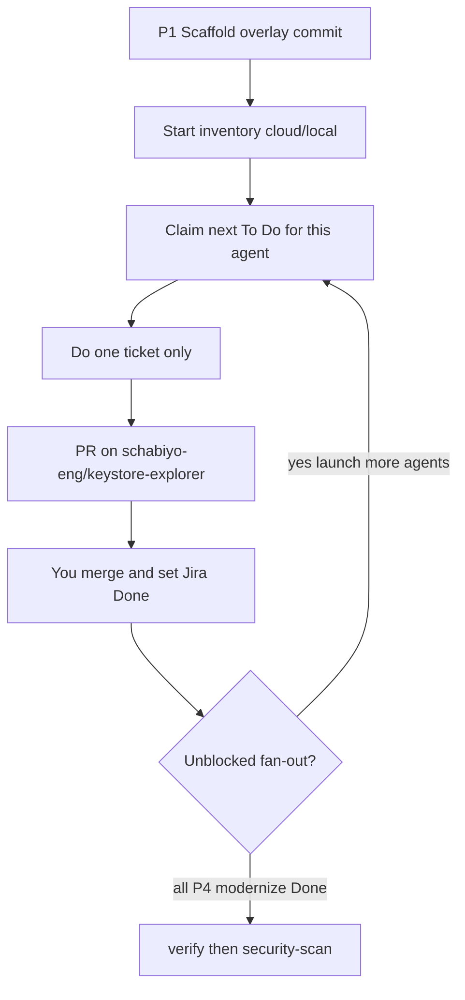

# Migration runbook (greenfield, Phase 1 first)

Copy this overlay onto [schabiyo-eng/keystore-explorer](https://github.com/schabiyo-eng/keystore-explorer). Jira is the queue. Cloud agents scale **unblocked** tickets in parallel. Never push or open a PR against public upstream (`kaikramer/keystore-explorer`).

Orchestration: [ORCHESTRATION.md](ORCHESTRATION.md). Pickup: [model-b/PICKUP.md](model-b/PICKUP.md). Seed table: [model-b/jira.md](model-b/jira.md).

Replace the Jira key after copy:


| Placeholder | Meaning          |
| ----------- | ---------------- |
| `YOURKEY`   | Jira project key |


Git origin is [schabiyo-eng/keystore-explorer](https://github.com/schabiyo-eng/keystore-explorer). Never public upstream (`kaikramer/keystore-explorer`).

## Loop




Do not implement specialist work in the parent chat.

---


## Phase 1 — Scaffold (once, git only)

P1 is **not** a Jira issue. It is the overlay landing on a clean upstream tree.

1. Create a **private** GitHub repo from upstream KeyStore Explorer (or clone upstream and set `origin` to [schabiyo-eng/keystore-explorer](https://github.com/schabiyo-eng/keystore-explorer) only). Confirm:

```bash
git remote -v   # origin = schabiyo-eng/keystore-explorer; no push URL to kaikramer/keystore-explorer
```

1. Copy **only** these reusable artifacts (do **not** copy signed discovery, YAML, `frontend/src/dummy/`, dispatcher scripts, or `backlog.json`):

```
.cursor/master-plan.md
.cursor/ORCHESTRATION.md
.cursor/RUNBOOK.md
.cursor/agents/          # inventory, test-generation, migrate, modernize, verify, security-scan
.cursor/skills/
.cursor/rules/
.cursor/model-b/         # jira.md, PICKUP.md, TICKET.template.md
.cursor/discovery/ARCH.md
.cursor/discovery/UI.md
# optional unsigned proposal only — inventory still owns this file:
# .cursor/discovery/SCOPE.md
```

1. In the new tree, replace `YOURKEY` in `PICKUP.md`, `jira.md`, `ORCHESTRATION.md`, and this runbook. PRs already target `schabiyo-eng/keystore-explorer`.
2. Connect **Jira / Atlassian MCP** in Cursor. Create an empty Jira project; set its key to `MOD`. Add statuses **In Review** and **Blocked** (In Progress category) if missing.
3. Commit the overlay on [schabiyo-eng/keystore-explorer](https://github.com/schabiyo-eng/keystore-explorer) (`chore(p1): Cursor rewrite overlay`). That commit **is** Phase 1 Done.
4. Seed Jira: run the [seed-jira](skills/seed-jira/SKILL.md) skill (from [jira.md](model-b/jira.md)). Workstream + every seed Task, labels `agent-*` / `slice-*` / `phase-*`, **Blocks** links as in the table. Descriptions = [TICKET.template.md](model-b/TICKET.template.md) filled in. All issues **To Do**. Do not mark P2/P3 Done.


## Phase 2 — Discovery

Start **inventory** (local or one cloud agent):

```
Jira is the queue. Claim the next issue for this agent. PRs only to schabiyo-eng/keystore-explorer.
```

Agent writes `.cursor/discovery/INVENTORY.md`, `DOMAIN.md`, `SCOPE.md` (proposal), `STATUS.md`. You **sign** `SCOPE.md` (`Status: signed` + checkboxes). Merge the discovery PR. Jira → Done.

Do not copy this clone’s signed `INVENTORY.md` / `SCOPE.md` / YAML into the new repo.

## Phase 3 — YAML (fan-out)

1. Start **test-generation** on `P3.schema` (one agent). That ticket freezes `schema.md` and `control-ids.md` for **every** in-scope action. Merge when those files plus `STATUS.md` exist.
2. Then launch **several test-generation cloud agents** (one per unblocked `P3.yaml.`*). Each ticket only adds `flows/<slice>/*.yaml`. Do not edit `schema.md` / `control-ids.md` on those tickets.


## Phase 4 — Rewrite (trunk, then fan-out)

1. **Trunk (serial):** `P4.kernel` → `P4.kernel-modernize` → `P4.file` → `P4.file-modernize` → `P4.session` → `P4.session-modernize`. You review kernel, File, and session at least once.
  - File owns `frontend/src/shell/` as the **plugin host**: full SCOPE menubar (disabled until a feature registers), glob `../features/*/index.ts`, frozen session `apply` API, one dialog host.
  - Session fills undo/history/password stubs. It does not replace the host or add menu rows.
2. **Leaf fan-out:** when session modernize is Done **and** a leaf’s YAML is Done, that `P4.<slice>` is unblocked. Launch **several migrate cloud agents**. Each adds only `frontend/src/features/<slice>/`. After each migrate merges, start **modernize** on that slice.
3. **Selection-heavy:** clipboard after delete-rename modernize; chain after details modernize. Do not launch them with the first leaf wave.


## Phase 5

When **every** `P4.*-modernize` is Done: start **verify**, then **security-scan**.

## Each ticket (any phase after P1)

1. Specialist claims via [PICKUP.md](model-b/PICKUP.md) (In Progress before edits).
2. Acceptance command on the issue. Stop if it stays red after a focused attempt.
3. Draft PR (`pr-composition`) against **schabiyo-eng/keystore-explorer** only. Jira → In Review; paste the fork PR URL.
4. You merge. You set Jira **Done**.

Cloud: N agents of the **same** type may run if N tickets are unblocked. Each claims one issue (transition In Progress is the lock). If the transition fails, skip to the next To Do.

## Stop conditions

- Empty JQL for this agent: stop; start the agent that has unblocked To Do (or wait on the trunk).
- `SCOPE.md` not `Status: signed`: abort test-generation and migrate (inventory may proceed).
- High/Critical in Phase 5: you review; agents do not auto-fix.
- `git remote` or `gh pr` targeting public upstream: abort.


## Concern

## In-browser PKCS#12 will not match BouncyCastle bag-for-bag. Platform stores stay out of scope. File is a larger ticket because it must prove the plugin host (a stub `features/` module enables a command with no shell diff). If File skips that, leaf clouds will collide on the menubar.

