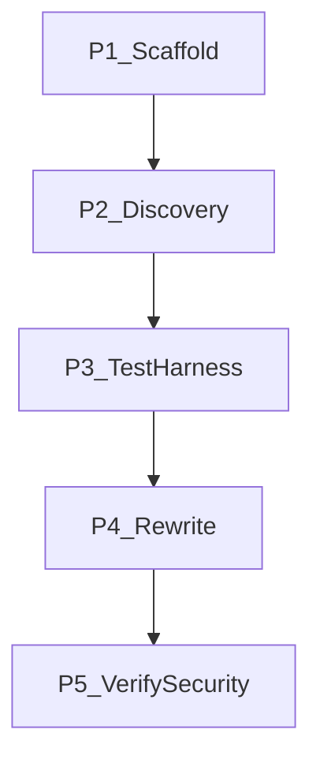

# KeyStore Explorer full rewrite — master plan

Orchestration only. Agents execute **subplans**, not this document.

**Rewrite boundary (locked):** Self-contained React SPA. Real PKCS#12 in the client (`frontend/src/kernel/`). No dummy store. No Java REST sidecar. Swing stays in-repo as reference; `[.cursor/rules/no-java-swing.mdc](rules/no-java-swing.mdc)` forbids *new* Swing UI. Architecture: `[.cursor/discovery/ARCH.md](discovery/ARCH.md)`.

**Tracker:** Jira project **MOD** (replace after Phase 1). Loop and steps: [RUNBOOK.md](RUNBOOK.md). Pickup: [model-b/PICKUP.md](model-b/PICKUP.md). Issues: [model-b/jira.md](model-b/jira.md). Scope lock after discovery: [discovery/SCOPE.md](discovery/SCOPE.md).

**Five phases.** Phase 1 is **scaffold** (done when the files listed there exist). Discovery output lives under `.cursor/discovery/`. **Verify and security-scan run only in Phase 5**, not per slice in Phase 4.




---


## Sequencing constraints (hard)

- Phase 1 must land before any other agent session (prompts and rules are the guardrails).
- **No React UI** until Phase 3 schema exists and a human has signed [SCOPE.md](discovery/SCOPE.md).
- Phase 4 **kernel** lands before File shell. File must land the plugin host before session and leaves. Do not extend `frontend/src/dummy/` — delete it in `P4.kernel`.
- Phase 4 slices need: discovery row for that slice, YAML for that slice (kernel may use unit tests + round-trip oracles), kernel contract, both guardrail rules.
- **Do not launch** `verify` **or** `security-scan` **until Phase 5.** Phase 4 may run slice-level tests while migrating; full-harness verify and security audit wait.
- One PKCS#12 implementation only (see ARCH.md). Do not add a second parser in a slice PR.
- No new product features. Swing behavior is frozen after Phase 2 sign-off.
- No feature-flag / coexistence agent (full rewrite, not strangler).
- Subplans S/M only. **Model B:** Jira is the master. Start the named specialist; it claims via [PICKUP.md](model-b/PICKUP.md). Follow [RUNBOOK.md](RUNBOOK.md). PRs only to [schabiyo-eng/keystore-explorer](https://github.com/schabiyo-eng/keystore-explorer). Do not implement specialist work in the parent chat. Cloud agents scale unblocked tickets of the same type; they do not skip Phase 1.

---


## Phase 1 — Scaffold (first)

**Goal:** Cursor automation surface exists.


| Path                                                                         | Role                                                                 |
| ---------------------------------------------------------------------------- | -------------------------------------------------------------------- |
| `[.cursor/agents/inventory.md](agents/inventory.md)`                         | Crawl Swing; classified inventory                                    |
| `[.cursor/agents/test-generation.md](agents/test-generation.md)`             | YAML harness; reads `.cursor/discovery/`; writes `functional-tests/` |
| `[.cursor/agents/migrate.md](agents/migrate.md)`                             | Convert a slice to React + kernel                                    |
| `[.cursor/agents/modernize.md](agents/modernize.md)`                         | Idiomatic React pass after migrate                                   |
| `[.cursor/agents/verify.md](agents/verify.md)`                               | Phase 5 only: full YAML/driver                                       |
| `[.cursor/agents/security-scan.md](agents/security-scan.md)`                 | Phase 5 only: audit; flag only                                       |
| `[.cursor/skills/pr-composition/SKILL.md](skills/pr-composition/SKILL.md)`   | PR title, sections, atomicity                                        |
| `[.cursor/skills/react-migration/SKILL.md](skills/react-migration/SKILL.md)` | Cookbook: Swing → React + PKCS#12 kernel                             |
| `[.cursor/rules/e2e-contract.mdc](rules/e2e-contract.mdc)`                   | Selectors and oracles                                                |
| `[.cursor/rules/no-java-swing.mdc](rules/no-java-swing.mdc)`                 | No new Swing UI                                                      |
| `[.cursor/rules/swing-visual-parity.mdc](rules/swing-visual-parity.mdc)`     | React looks like Swing chrome                                        |
| `[.cursor/discovery/ARCH.md](discovery/ARCH.md)`                             | Crypto/runtime lock (kernel)                                         |
| `[.cursor/discovery/UI.md](discovery/UI.md)`                                 | Visual chrome lock (menubar/table/dialogs)                           |
| `[.cursor/RUNBOOK.md](RUNBOOK.md)`                                           | Greenfield from Phase 1                                              |
| `[.cursor/ORCHESTRATION.md](ORCHESTRATION.md)`                               | Agent boundaries                                                     |
| `[.cursor/model-b/jira.md](model-b/jira.md)`                                 | Seed DAG                                                             |
| `[.cursor/model-b/PICKUP.md](model-b/PICKUP.md)`                             | Claim JQL                                                            |


Skip `feature-flag-management`.

**Done when** those paths exist on [schabiyo-eng/keystore-explorer](https://github.com/schabiyo-eng/keystore-explorer) and `YOURKEY` is replaced. Then seed Jira (nothing pre-Done) and start **inventory**.

---


## Phase 2 — Discovery

**Owner:** `inventory`. Output **only** under `.cursor/discovery/` (do not overwrite `ARCH.md` or `UI.md`).

```
.cursor/discovery/
  ARCH.md      # Phase 1; inventory must not rewrite
  UI.md        # Phase 1 visual chrome; inventory must not rewrite
  INVENTORY.md
  DOMAIN.md
  SCOPE.md     # in-scope vs out-of-scope; human signs
  STATUS.md
```

Tags: `core` | `entry-keypair` | `entry-trusted` | `entry-key` | `platform` | `chrome` | `skip`.

**SCOPE:** full rewrite of PKCS#12 SPA-capable actions. Out: `platform`, `skip`, L&F prefs, JCA bag-for-bag, Java sidecar. Human signs `SCOPE.md` before Phase 3/4.

---


## Phase 3 — Test harness

**Owner:** `test-generation`. **Law:** `e2e-contract.mdc`. YAML under `functional-tests/flows/<slice>/`. Playwright does not drive Swing. `reopenSucceeds` means the kernel parses bytes it wrote.

**DAG:** `P3.schema` first — freeze full `when`/`then` vocabulary and `control-ids.md` for every in-scope action. Then one Jira ticket per slice (`P3.yaml.`*) that only writes `flows/<slice>/*.yaml`.

---


## Phase 4 — Rewrite

`frontend/` + **keystore kernel**. Per slice: **migrate → modernize → PR**. No verify/security-scan agents.

**Trunk (serial):** kernel (`frontend/src/kernel/`) → File shell as **plugin host** (`frontend/src/shell/`: full menubar stubs, glob loader, session `apply`, dialog host) → session (undo/history/password implementations).

**Leaf fan-out (parallel after session modernize):** generate, import, delete-rename, details, export, sign, verify-sig, examine, chrome — each **only** `frontend/src/features/<slice>/`. Blocked by session modernize **and** that slice’s YAML.

**Selection-heavy:** clipboard after delete-rename modernize; chain after details modernize.

---


## Phase 5 — Verify and security scan

`verify` full in-scope YAML, then `security-scan`, then cutover. Blocked by **every** P4 modernize. Human review of High findings. No auto-fix. Private keys live in the JS heap; treat password and XSS findings as product-grade.

---


## Concern

In-browser PKCS#12 will not match BouncyCastle/JCA bag-for-bag. Interop with files Swing wrote is an explicit kernel acceptance test, not an accident of UI. If testdata `.p12` passwords are unknown, those scenarios stay `blocked` — do not guess. Existing JUnit on `kse/` remains the Java crypto backstop; the SPA must still round-trip its own files.